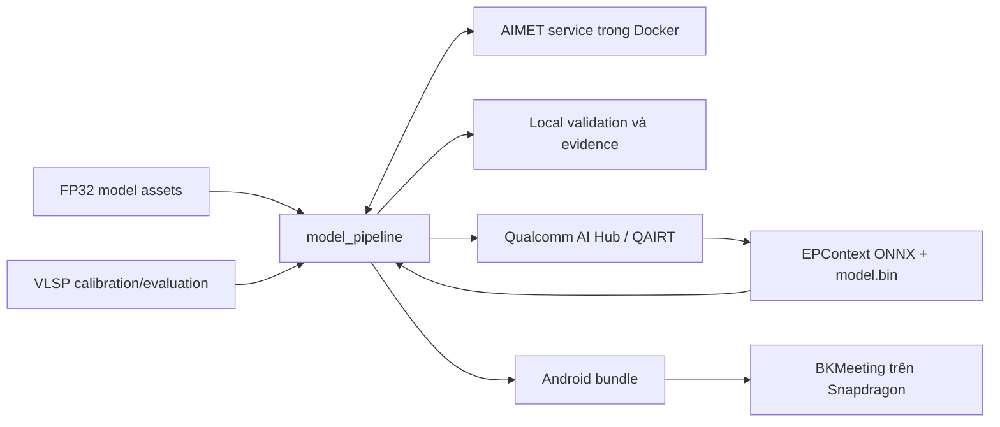
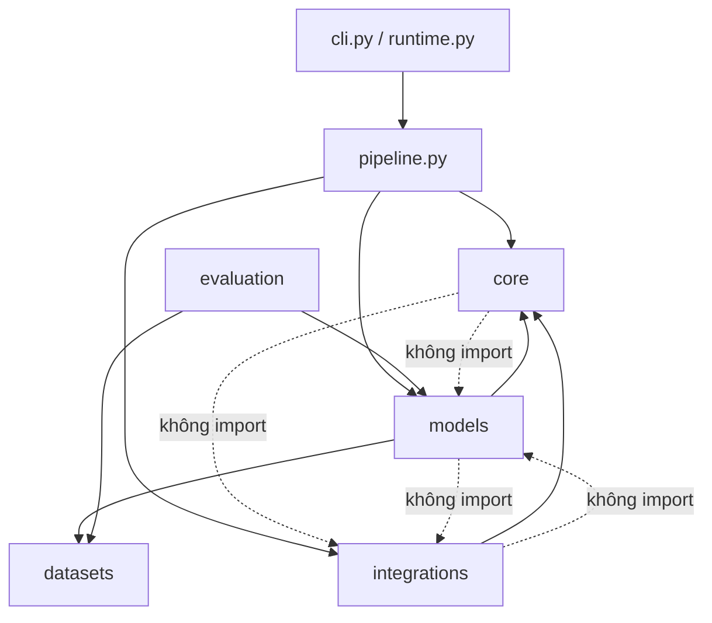
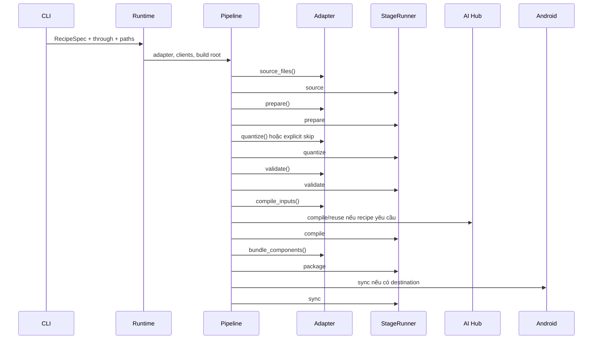
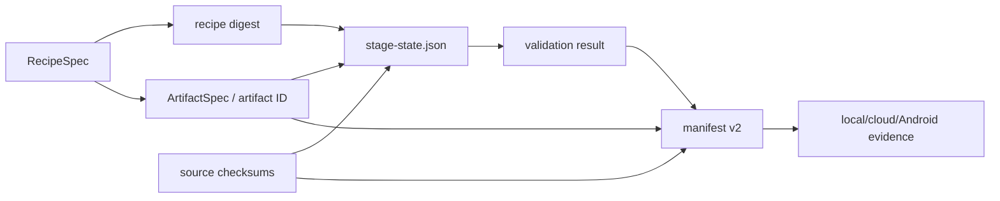
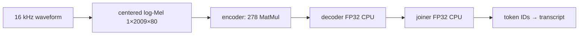
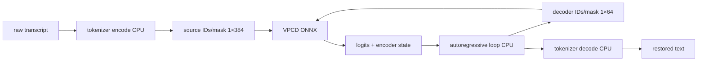

# Kiến trúc Model Pipeline

`quantized-viet-asr-model` biến source model và calibration data thành artifact có identity, validation và provenance rõ ràng. Package công khai duy nhất là `src/model_pipeline/`; BKMeeting chỉ tiêu thụ output sau bước package/sync.

## Bức tranh toàn cảnh



Local pipeline chứng minh graph, quantization scope và output parity trước compile. AI Hub chứng minh artifact có thể compile/live-run trên Qualcomm target. Chỉ BKMeeting strict test trên thiết bị thật mới chứng minh Android runtime dùng Qualcomm Hexagon Tensor Processor (HTP) mà không fallback.

## Package và dependency boundary



| Khu vực | Sở hữu | Không sở hữu |
|---|---|---|
| `core` | specs, manifest v2, checksum, deterministic stage runner | model semantics, cloud SDK, Android |
| `models` | recipe, source resolution, prepare, calibration, graph transform, quantization, local runtime | AI Hub/Android client |
| `datasets` | VLSP streaming/selection/materialization và golden fixtures | model inference policy |
| `evaluation` | metrics, provider attribution, JSON/JSONL reports | graph mutation hoặc cloud submission |
| `integrations/aihub` | authentication, compile/reuse, download, hosted inference, compiled validation | model-specific calibration |
| `integrations/android` | manifest-v2 bundle và deterministic sync | Android runtime/provider implementation |
| `pipeline.py` | orchestration giữa mọi boundary | model-specific graph details |

Boundary được khóa bằng `test/test_model_pipeline_boundaries.py`.

## Public execution flow



| Stage | Input chính | Output chính | Owner | Failure điển hình | Resume khi |
|---|---|---|---|---|---|
| `source` | recipe và filesystem | source files đã copy vào stage | adapter + pipeline | thiếu asset hoặc calibration | source checksum và recipe digest khớp |
| `prepare` | FP32 components | fixed-shape/rewritten ONNX | model adapter/graph | shape hoặc graph rewrite sai | input/output checksum khớp |
| `quantize` | prepared graph + calibration | AIMET package, Q/DQ ONNX hoặc explicit skip | model adapter + AIMET | calibration/policy/export lỗi | action, recipe và bytes khớp |
| `validate` | quantized/prepared components | `validation.json` | model adapter | graph count, encoding hoặc scope sai | component checksums khớp |
| `compile` | validated ONNX/package | `EPContext` ONNX và external context | AI Hub integration | unsupported op/dtype/target | checksum-keyed evidence còn hợp lệ |
| `package` | validated CPU + compiled target components | manifest-v2 bundle | Android integration | thiếu component/metadata | toàn bộ input/output digest khớp |
| `sync` | package bundle + destination identity | destination reconciliation record | Android integration | destination contract không tương thích | bundle và destination digest khớp |

Mỗi stage chỉ được tạo file bên trong stage directory. `StageRunner` xóa riêng stage cache invalid trước khi chạy lại; không tin `stage-state.json` nếu output file mất hoặc checksum đổi.

## Recipe, artifact và manifest lifecycle

`RecipeSpec` là lựa chọn hành vi: configuration, component roles, shape, graph contract và stage actions. `RecipeSpec.digest` thay đổi khi bất kỳ field định nghĩa recipe nào thay đổi.

`ArtifactSpec` là identity có thể parse/round-trip:

```text
<model>__q-<engine>-<weight>-<activation>-<scope>__s-<shape>__c-<compiler>-<target>-<compiled-scope>
```

Ví dụ:

```text
vpcd__q-aimet-int8-int16-encoder-matmul__s-src1x384-dec1x64__c-aihub-qnn-htp-model
```

Artifact ID mô tả model, quantization, fixed shape và compilation target; không chứa tên notebook, thử nghiệm hay đánh giá chủ quan.

Manifest v2 được tạo ở package stage. Mỗi component ghi:

- role và filename;
- format và precision;
- named input shapes;
- quantization engine/scope;
- execution target;
- SHA-256 checksum.

Manifest còn ghi source checksums, recipe digest, validation, runtime metadata và fixture references. Backend không được suy từ tên thư mục.



## AIMET service boundary

AIMET service nhận duy nhất:

- fixed-shape FP32 ONNX;
- directory các calibration `.npz`;
- MatMul-only config;
- operator allow/disable policy;
- output directory nằm trong repo mount.

Service không biết Zipformer hay VPCD. Adapter sở hữu cách tạo calibration và operator policy. Với operator-name allowlist, service tắt toàn bộ tensor quantizer rồi chỉ bật quantizer gắn với node được chọn. VPCD còn bắt buộc selected activation quantizer dùng symmetric signed 16-bit range với offset `-32768` để đáp ứng HTP MatMul contract; parameter quantizer không bị ép symmetry và phải giữ nguyên encoding đã hiệu chỉnh.

## Zipformer data flow



Prepare freeze cả ba component. Encoder được ONNX Runtime Extended optimize với `MatMulAddFusion` tắt, symbolic shape inference và boolean-mask rewrite. AIMET configuration quantize encoder MatMul bằng signed 8-bit weight và signed 16-bit activation; decoder/joiner `Gemm` giữ FP32.

Local CPU/CUDA chỉ thay provider của encoder; decoder và joiner luôn CPU. Sau AI Hub compile, Android dùng `encoder.onnx` dạng `EPContext` cùng adjacent `model.bin` trên QNN HTP, rồi tiếp tục decode bằng decoder/joiner CPU.

## VPCD data flow



Graph có 265 MatMul: 96 encoder, 168 decoder và một language-model head. Chỉ 96 encoder MatMul được chọn; decoder/language-model head/non-MatMul giữ nguyên. Attention mask dùng `Cast(INT32) → Equal(0)` để tránh floating-point-to-boolean cast bị HTP từ chối.

VPCD model session có thể chạy trên CPU, CUDA/mixed hoặc post-compile HTP. Tokenizer và host autoregressive loop luôn CPU. Vì mỗi decode step gọi lại model, one-step hosted top-1 parity không thay thế full Android autoregressive validation.

## Phân biệt các artifact

| Artifact | Dùng ở đâu | Nội dung | Có chạy local CPU/GPU? |
|---|---|---|---|
| FP32 prepared ONNX | control/compile input | fixed shape và graph rewrite | Có |
| AIMET package trước compile | local parity và AI Hub input | `model.onnx`, `model.encodings`, policy/config | Có |
| ORT-QNN Q/DQ ONNX | Zipformer local alternative | ONNX có Q/DQ | Có nếu provider hỗ trợ |
| Post-compile package | Qualcomm deployment | ONNX wrapper có `EPContext` + adjacent `model.bin` | Không trên CPU/NVIDIA local |
| Android bundle | BKMeeting asset delivery | post-compile target + CPU support files + manifests/fixtures | Chỉ đúng khi Android runtime contract khớp |

Không copy file `quantize/aimet/model.onnx` vào Android rồi gọi đó là model NPU. Artifact deployment là cặp post-compile `.onnx + model.bin`; Zipformer cần thêm decoder/joiner/tokens, VPCD cần tokenizer/mappings và host-loop contract.

## Local, cloud và device truth

| Tầng | Chứng minh được | Không chứng minh được |
|---|---|---|
| Local CPU/CUDA | graph contract, quantization coverage, output parity, provider-attributed host latency | Qualcomm HTP execution hoặc Android packaging |
| AI Hub compile/hosted | QAIRT chấp nhận graph, downloaded package contract, bounded HTP inference | full Android runtime, memory, startup hoặc 100-sample device quality |
| BKMeeting physical Snapdragon | asset loading, QNN provider, strict no-fallback execution, app latency/output | model-training hoặc calibration provenance nếu manifest thiếu |

Kết luận phải nêu đúng tầng evidence. Filename, manifest hoặc emulator không đủ để tuyên bố NPU success.

## Dataset và evaluation

VLSP selector stream parquet, chọn 24 calibration từ shard đầu và 100 evaluation từ shard sau, rồi dừng; không giữ corpus trong RAM. Evaluation lọc audio 2–12 giây và transcription 4–40 từ. Manifest chỉ lưu relative audio path, shard/row và audio/text checksum.

Zipformer evaluation đo normalized character/word error rate, exact transcript parity, empty/collapse và latency. VPCD đo full-output parity, character edit distance, first-five-step top-1, early end-of-sequence/collapse và latency. CUDA chỉ được ghi nhận khi ONNX Runtime profiler thấy node thực thi trên CUDA.

## Android handoff boundary

`integrations/android/repository.py` materialize một repository duy nhất gồm `model-index.json`, manifest v2, bốn artifact canonical và fixtures. Output được stage đầy đủ rồi promote nguyên tử; mọi path tương đối và mọi component có SHA-256.

BKMeeting main app và benchmark cùng consume repository này. CPU build chỉ chọn hai FP32 artifacts. QNN build chỉ chọn hai post-compile artifacts cùng CPU support components. Appium package chọn FP32 và NPU của đúng một model; không có benchmark-only model export.

Sau handoff, BKMeeting sở hữu Gradle filtering, asset pack, ONNX Runtime Android, strict HTP tests, app pipeline và device evidence. Python repo tiếp tục sở hữu artifact identity, provenance, graph contract và fixture truth. Xem [AI Hub → Android operations](aihub-android-operations.md).

## Development contract

Mọi tracked change phải tuân theo [AGENTS.md](../AGENTS.md). Source change phải đi cùng canonical-doc update ngoài plan. Function Python viết tay trong `src/model_pipeline/` và `test/` dùng Google-style English docstring. Đọc [source-code guide](source-code-guide.md) trước khi chọn extension point.
